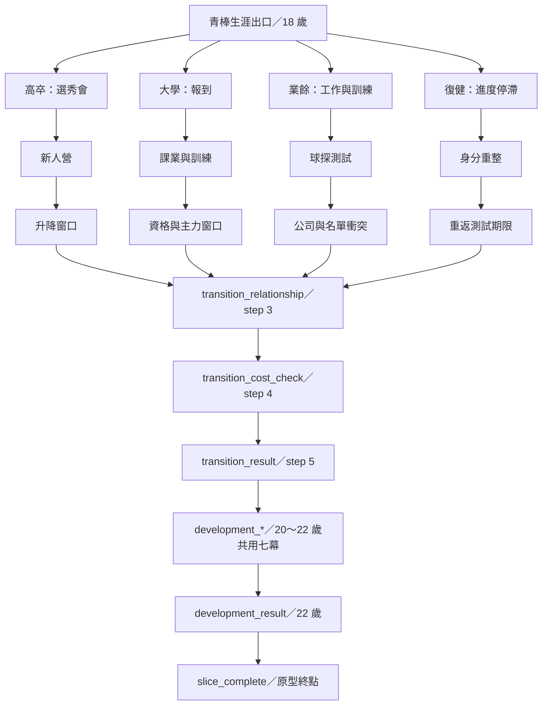

# Architecture Sprint 4.3：Career Network Contract & Transition Readiness

## 文件目的與基線

本文件記錄 `da7fea0` 基線上，成年 Career Network 的實際 Gameplay 拓撲與後續轉線準備度。它描述現況，不新增成年內容，也不把候選轉換視為已實作路由。

查核來源：

- `story.js` 的 `getCurrentEventId()`、`getEvent()` 與成年事件集合。
- `script.js` 的 `choose()`、`enterCareerTransition()`、`enterDevelopmentYears()`、`advanceAfterAction()`、`evaluateCriticalYear()`、`evaluateCareerTransition()`、`evaluateDevelopmentYears()`。
- `player.js` 的初始狀態。
- `save.js` 的整體 Player 儲存與 `normalizeSave()`。
- 現有成年、高中、垂直切片與存檔測試。

## 1. 現行成年路由表

### 1.1 高中出口與成年入口

| 節點 | 初始出口 | 年齡 | Chapter／Step | Event ID | 專屬或共用 | 實際下一節點 | 結算條件 |
|---|---|---:|---|---|---|---|---|
| 高中出口評估 | 高卒選秀 | 18 | 青棒關鍵年／8 | `critical_year_result` | 出口共用 | 生涯轉換期／0 | `entered_high_school_draft`；球探評價、主要工具與健康決定「候選」或「落選／培訓測試」 |
| 高中出口評估 | 大學棒球 | 18 | 青棒關鍵年／8 | `critical_year_result` | 出口共用 | 生涯轉換期／0 | `chose_college_baseball` |
| 高中出口評估 | 業餘／社會人 | 18 | 青棒關鍵年／8 | `critical_year_result` | 出口共用 | 生涯轉換期／0 | `chose_amateur_baseball` |
| 高中出口評估 | 復健／暫停 | 18 | 青棒關鍵年／8 | `critical_year_result` | 出口共用 | 生涯轉換期／0 | 未命中前三項時的現行 fallback；正常選項會留下 `chose_rehab_before_career` |

### 1.2 生涯轉換期

| 節點 | 初始出口 | 年齡 | Chapter／Step | Event ID | 專屬或共用 | 實際下一節點 | 結算條件 |
|---|---|---:|---|---|---|---|---|
| 選秀／職業入口 | 兩種高卒出口 | 18 | 生涯轉換期／0 | `transition_draft_day` | 路線專屬 | 同路線 step 1 | 完成一個選項 |
| 新人營 | 兩種高卒出口 | 18 | 生涯轉換期／1 | `transition_rookie_camp` | 路線專屬 | 同路線 step 2 | 完成一個選項 |
| 第一次升降窗口 | 兩種高卒出口 | 18 | 生涯轉換期／2 | `transition_pro_roster_window` | 路線專屬 | 共用 step 3 | 完成一個選項 |
| 大學報到 | 大學棒球 | 18 | 生涯轉換期／0 | `transition_college_arrival` | 路線專屬 | 同路線 step 1 | 完成一個選項 |
| 課業與訓練 | 大學棒球 | 18 | 生涯轉換期／1 | `transition_college_balance` | 路線專屬 | 同路線 step 2 | 完成一個選項 |
| 資格與主力窗口 | 大學棒球 | 18 | 生涯轉換期／2 | `transition_college_eligibility` | 路線專屬 | 共用 step 3 | 完成一個選項 |
| 工作與訓練 | 業餘／社會人 | 18 | 生涯轉換期／0 | `transition_amateur_job` | 路線專屬 | 同路線 step 1 | 完成一個選項 |
| 少數球探的測試 | 業餘／社會人 | 18 | 生涯轉換期／1 | `transition_amateur_test` | 路線專屬 | 同路線 step 2 | 完成一個選項 |
| 公司與名單衝突 | 業餘／社會人 | 18 | 生涯轉換期／2 | `transition_amateur_company_conflict` | 路線專屬 | 共用 step 3 | 完成一個選項 |
| 復健停滯 | 復健／暫停 | 18 | 生涯轉換期／0 | `transition_rehab_plateau` | 路線專屬 | 同路線 step 1 | 完成一個選項 |
| 球員身分重整 | 復健／暫停 | 18 | 生涯轉換期／1 | `transition_rehab_identity` | 路線專屬 | 同路線 step 2 | 完成一個選項 |
| 重返測試期限 | 復健／暫停 | 18 | 生涯轉換期／2 | `transition_rehab_reentry_deadline` | 路線專屬 | 共用 step 3 | 完成一個選項 |
| 關係回收 | 全部 | 18 | 生涯轉換期／3 | `transition_relationship` | 四路共用；首次交會 | 共用 step 4 | 完成一個選項 |
| 代價檢查 | 全部 | 18 | 生涯轉換期／4 | `transition_cost_check` | 四路共用 | 生涯轉換期小結 | `transitionStep` 遞增至 5 後執行 `evaluateCareerTransition()` |
| 轉換期結果 | 全部 | 18 | 生涯轉換期小結／5 | `transition_result` | 四路共用 | 發展期／0 | 玩家選擇進入發展期 |

`transition_relationship` 的實際功能是依過往關係提供回響或缺席；`transition_cost_check` 依初始出口呈現不同代價。兩者共用事件 ID，但其內部文字與效果仍可讀取 `careerExit`、人物關係與既有狀態。

### 1.3 20～22 歲共用發展期

| 節點 | 初始出口 | 年齡 | Chapter／Step | Event ID | 專屬或共用 | 實際下一節點 | 結算條件 |
|---|---|---:|---|---|---|---|---|
| 日常角色 | 全部 | 20 | 發展期／0 | `development_daily_life` | 共用事件、路線變體文字 | step 1 | 完成一個選項 |
| 新競爭者 | 全部 | 20 | 發展期／1 | `development_competition` | 共用事件、路線變體文字 | step 2 | 完成一個選項 |
| 導師回應 | 全部 | 20 | 發展期／2 | `development_mentor` | 共用 | step 3 | 完成一個選項 |
| 身體抉擇 | 全部 | 21 可由 Debug 建立；正常入口仍從 20 開始 | 發展期／3 | `development_body_choice` | 共用 | step 4 | 完成一個選項 |
| 再次被需要 | 全部 | 21 可由 Debug 建立 | 發展期／4 | `development_opportunity` | 共用事件、路線變體文字 | step 5 | 完成一個選項 |
| 市場再評價 | 全部 | 20～21 | 發展期／5 | `development_market` | 共用 | step 6 | 完成一個選項 |
| 是否再賭一次 | 全部 | 20～21 | 發展期／6 | `development_decision` | 共用 | 二十二歲職涯小結 | `developmentStep` 遞增至 7 後執行 `evaluateDevelopmentYears()`，同時把年齡設為 22 |
| 二十二歲結果 | 全部 | 22 | 二十二歲職涯小結／7 | `development_result` | 共用結果、依 `careerExit` 分支結算 | 垂直切片完成 | 玩家選擇「完成二十二歲發展期測試」 |
| 原型終止頁 | 全部 | 22 | 垂直切片完成 | `slice_complete` | 共用 | 無正式下一節點 | `completed=true`；只提供重新開始 |

## 2. 現行成年路由圖

以下僅包含已由 `getCurrentEventId()` 與推進函式證實的 actual edges：

結論：四路第一次真正重新交會在 `transitionStep=3`。它們之後共用相同事件 ID；20～22 歲也完全共用 `development_*` 事件序列。路線差異主要由事件內文、結算與 `careerExit` 條件保留，而不是由不同 chapter 或不同 event chain 保留。

`transition_checkpoint` 雖仍存在於事件資料與部分呈現／回響邏輯，但不在 `getCurrentEventId()` 的成年序列，也不在四條 `adultNarrativeChains`；因此不是 actual edge。

## 3. `careerExit` 責任表

設計理想語意：高中畢業時的第一個職涯出口，屬於不可被後續轉線覆寫的歷史事實。

現行實際語意：它既是歷史出口，也同時是成年事件路由鍵、敘事變體鍵、組織角色與市場結算鍵，以及 UI 顯示資料。

| 使用位置 | 讀或寫 | 現行用途 | 是否符合初始出口語意 | 未來風險 |
|---|---|---|---|---|
| `player.js:createInitialPlayer()` | 初始化 | 空字串 | 是 | 無法單靠空字串區分「未評估」與損壞的成年存檔 |
| `script.js:evaluateCriticalYear()` | Gameplay 寫入 | 依高三出口選擇、評價與健康寫入五種合法值 | 是 | 目前是唯一正常 Gameplay 寫入點，應保留為歷史來源 |
| `script.js` Debug 書籤 | 測試寫入 | 直接建立成年路線狀態 | 僅測試用途 | Debug 年齡與中間結果需持續跟契約同步 |
| `story.js:getCurrentEventId()` | 路由讀取 | 決定 draft／college／amateur／rehab 事件鏈 | 否，已兼任目前路線 | 未來大學轉職業後若保留原值，路由仍判為大學；若改寫，會失去高中出口歷史 |
| `story.js` 成年事件文字 | 敘事讀取 | 決定職業、大學、業餘、復健版本 | 部分符合 | 初始來源與目前處境被視為同一件事 |
| `script.js:getAdultRouteKey()`／Narrative Thread | 敘事控制讀取 | 選擇當期人物、問題與連續事件脈絡 | 否 | 對非法值預設為 draft，但 `getCurrentEventId()` 對非法值 fallback 為 rehab；合法值沒有差異，損壞狀態有分歧 |
| `script.js:evaluateCareerTransition()` | 結算讀取 | 產生組織角色、轉換結果與角色身分 | 部分符合 | 未來轉線後仍會以高中出口重算目前組織角色 |
| `script.js:evaluateDevelopmentYears()` | 結算讀取 | 產生 22 歲市場出口與發展結果 | 否，已兼任目前路線 | 無法描述「大學畢業後進職業」等第二次轉換 |
| `script.js:queueAzheAdultRecordEcho()` | 敘事條件讀取 | 判斷是否帶有復健來源 | 部分符合 | 日後的傷後復健與高中直接復健可能混為一類 |
| `script.js:updateStatus()`、`story.js:critical_year_result`／`slice_complete` | UI／結果讀取 | 顯示生涯出口 | 是 | 若未來改寫 `careerExit`，顯示的歷史會被覆蓋 |
| `save.js` | 儲存／還原 | 整體序列化 Player；`normalizeSave()` 以 fresh Player 合併，不單獨遷移 `careerExit` | 是 | 新增現行路線欄位時需處理 v13 舊存檔的推導規則 |
| 回歸測試 | 測試讀寫 | 建立各路線 fixture、驗證出口與事件 | 混合 | 測試同時把它當歷史與現行路由，未來拆責任時需分層改寫 |

本次沒有修改任何 `careerExit` 讀寫。未來轉線前，至少必須把「初始出口歷史」與「目前路線」拆開；否則無法同時保存過去與正確路由現在。

## 4. 22 歲終點分析

1. `advanceAfterAction()` 在發展期把 `developmentStep` 加到 7 後呼叫 `evaluateDevelopmentYears()`。
2. `evaluateDevelopmentYears()` 把 `age` 設為 22，依 `careerExit` 與市場分數寫入 `marketOutcome`、`developmentResult`、`developmentDetail`，再把 chapter 設為「二十二歲職涯小結」。
3. `getCurrentEventId()` 對該 chapter 回傳 `development_result`。
4. `development_result` 的完成選項帶有 `completeSlice:true`。`choose()` 因而設定 `completed=true`，把 chapter 改為「垂直切片完成」，並重新呈現。
5. 此後 `getCurrentEventId()` 的最高優先判斷是 `completed`，固定回傳 `slice_complete`；即使殘留 `forcedEventId` 也不會蓋過它。
6. `slice_complete` 標題為「二十二歲，暫時寫到這裡」，正文說明「下一階段將依市場結果進入……」，但唯一按鈕是重新開始。

因此 22 歲不是完整人生結局，而是**原型內容終點兼未來職涯閘門**。文字承諾未來方向，程式尚未提供正式繼續入口。阻擋延伸的結構包括：

- `completed` 對所有其他路由具有最高優先權。
- 「垂直切片完成」是 terminal Contract node，沒有 actual next edge。
- `careerExit` 仍被同時用作初始歷史與目前路線。
- 只有 `marketOutcome` 描述下一個可能，沒有可路由的下一階段狀態。
- 沒有 22 歲後正式 chapter、progress 欄位與 Save migration。

## 5. Transition Candidate Matrix

以下全部是 candidate，不是 actual edge：

| 候選轉換 | 現行是否已存在 | 玩家價值 | 結構阻擋 | 最小所需狀態 | Save 影響 | 建議優先度 |
|---|---|---|---|---|---|---|
| 大學 → 職業 | 尚未；只有 `大卒選秀追蹤名單` 市場結果文字 | 高；兌現大學延長成長曲線的核心承諾 | 22 歲 terminal、缺目前路線、`careerExit` 耦合 | 保留初始出口；新增可辨識的目前路線與一次轉換結果 | 需要 v13 fallback／migration 設計 | 最高，4.4 唯一推薦 |
| 大學 → 業餘／社會人 | 尚未；存在「大學主力／落選風險並存」 | 中高；提供落選但不離開棒球的出口 | 同上，且缺業餘組織入口 | 目前路線、轉換結果；組織可先沿用既有 `organizationRole` | 需要 | 高，但不與 4.4 同做 |
| 業餘／社會人 → 職業 | 尚未；只有 `晚成選秀／職業測試邀請` | 高；能證明路線可重新交會 | 終點、缺選秀／測試決策與現行路線 | 初始出口、目前路線、轉換結果 | 需要 | 高，適合後續第二條切片 |
| 職業 → 業餘／社會人 | 尚未；現行只有二軍續留邊緣文字 | 中高；讓職業失敗不是終止 | 缺釋出狀態、離開組織決策與新入口 | 目前路線、是否仍為球員、轉換原因 | 需要 | 中 |
| 職業 → 棒球相關產業 | 尚未；只有「棒球第二角色」總括文字 | 中；支援人生不只一條成功方式 | 沒有產業角色、事件、組織或狀態基礎 | 是否仍為球員、目前身分 | 需要，且資料語意未定 | 低 |
| 大學 → 棒球相關產業 | 尚未 | 中；可回收學業與棒球理解 | 沒有產業入口與角色 | 是否仍為球員、目前身分 | 需要 | 低 |
| 業餘／社會人 → 棒球相關產業 | 尚未 | 中；與工作／棒球雙重身分相容 | 沒有產業入口與角色 | 目前身分；部分資訊可由 `organizationRole` 推導 | 可能需要 | 低至中 |
| 復健／暫停 → 重新競爭球員 | 尚未；已有 `復出測試／業餘隊邀請` 文字與復健測試事件 | 高；兌現復健不是死路 | 22 歲 terminal、缺重新進場路由與現行路線 | 目前路線、是否仍為球員、轉換結果 | 需要 | 高，適合後續獨立切片 |

## 6. 可能需要的最小資料契約

本 Sprint 不新增以下欄位。4.4 規格階段應先比較兩種最小方案：

### 必須能保留的兩個事實

1. 高中畢業初始出口：現有 `careerExit` 已能完整表達，應保留為歷史來源且不再被後續轉線改寫。
2. 玩家目前所在職涯路線：現有欄位無法在路線轉換後可靠重建，4.4 很可能需要一個正式、可存檔的最小欄位。

### 可先由既有資料衍生

- 目前組織或身分：短期可從 `organizationRole`、`roleIdentity`、chapter 與轉換結果合併呈現，不必先建立大型 Organization System。
- 目前是否仍為球員：若 4.4 只做「大學 → 職業」且兩端都是球員，可暫不新增；等第一次球員／非球員分流再正式定義。
- 轉換發生年齡：4.4 固定在 22 歲時，可由事件與 age 推知；只有支援多次或不同年齡轉線時才需要正式保存。

### 4.4 很可能需要的最小新增

- 一個「目前職涯路線」狀態，與歷史 `careerExit` 分離。
- 一個能指出 22 歲轉換是否已決定／完成的最小結果狀態；可優先評估沿用現有 result／flag，避免立刻建立完整 history array。
- 一個非 terminal 的 22 歲後 chapter 與 progress 契約；只有在玩家做出畫面上的轉換決定後才進入。

### 暫不需要

- 完整 `careerTransitionHistory` 陣列。
- 同時支援多次轉隊、退役、復出與產業轉職的通用狀態機。
- 新的組織、薪資、合約或選秀機率系統。

## 7. Architecture Sprint 4.4 唯一推薦

### 推薦：大學棒球 → 畢業選秀／職業入口

這是唯一推薦，不在 4.3 實作。

- **為何最小且有價值：**現行大學路線已具有資格壓力、輪替競爭、發展期表現、球探視野與 `大卒選秀追蹤名單`／`大學主力／落選風險並存` 兩種市場結果。它不需要先創造轉換理由，只需把已存在的結果變成玩家可見的正式決定與路由。
- **入口節點：**`二十二歲職涯小結` 的 `development_result`，且歷史 `careerExit === "大學棒球"`。
- **目標節點：**一個非 terminal 的「大卒選秀／職業入口」小型節點；實際 chapter、事件數與結果需由 4.4 規格決定。
- **必須保留：**`careerExit="大學棒球"` 作為高中畢業歷史；`marketOutcome`、健康、球探評價、近期表現、角色定位與既有人物回響。
- **最小資料：**目前職涯路線，以及本次畢業轉換是否已作出決定。不要用改寫 `careerExit` 代替。
- **主要風險：**解除 `completed` 前必須先建立新路由；Save v13 必須能推導舊存檔；`story.js` 與 `script.js` 的兩個成年 route helper 對非法值 fallback 不同；既有 `development_result` 目前直接完成切片。
- **4.4 不同時處理：**大學轉業餘、業餘轉職業、職業釋出、復健復出、棒球產業、第二次以上轉換、合約與選秀機率。

### 4.4 主要測試情境

1. 大學＋`大卒選秀追蹤名單`：可進入職業入口，但結果仍受現有健康與角色用途限制。
2. 大學＋`大學主力／落選風險並存`：不可被無條件送進職業；需保留可繼續的人生結果。
3. 高中初始 `careerExit` 在轉線後仍為「大學棒球」。
4. 舊 v13 大學存檔在 20 歲發展期、22 歲小結與已完成狀態都有明確兼容策略。
5. 高卒、業餘、復健三條路線完全維持目前終點，不被 4.4 誤接。
6. forced event、關係回響與 `completed` 優先序不造成重複結算或跳過決定。

## 8. Contract 實作摘要

`career-spine-contract.js` 本次增加：

- `CAREER_NETWORK_METADATA`：替現行成年節點標記生涯階段、網路角色、目前內容終點與 transition gap。
- `getActualEdges()`：只從既有 `nextChapters` 衍生 actual edge，不參與 Gameplay。
- `CANDIDATE_TRANSITIONS`／`getCandidateTransitions()`：獨立、唯讀、`implemented:false` 且沒有事件 ID。
- `getCareerNetwork()`：從既有 transition route 自動推導三幕專屬區段、共同 suffix、實際交會 step、共用發展期與目前終點。
- `getCareerNetworkSnapshot()`：延伸既有 Snapshot，回報成年路線、網路區段、actual next node、交會狀態、結果時機、終點與 transition gap。
- `auditCareerNetwork()`：檢查 node／edge／event 完整性、可達性、candidate 隔離與目前 runtime event 是否存在。

上述 API 全部只讀，不被 `story.js`、`script.js`、`choose()`、推進函式或 Save 匯入。它們是觀測與稽核層，不是新的 Router。

## 9. 已知缺口與停止線

- 青少棒分化 13／15 歲差異仍保留。
- 正常發展期由 20 歲進入，事件中不逐年改寫 age；部分 21 歲狀態只由 Debug 書籤建立。
- 四條成年路線於 transition step 3 交會，發展期事件 ID 完全相同。
- `careerExit` 的歷史／目前路線責任尚未拆分。
- 22 歲後沒有正式可玩節點。
- `transition_checkpoint` 仍是保留事件，但不是 actual edge。
- 本 Sprint 不修改以上缺口，不新增 Gameplay edge，不開啟 4.4。
