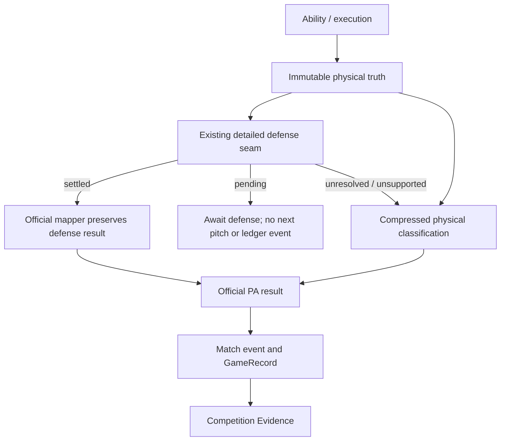

# Batted-Ball Outcome Mapping Foundation — Sprint 1

Physical Truth → Official Ball-in-Play Outcome。狀態：**PASS**。

本輪實作新的 physical-to-official mapping boundary；不做聯賽 fitting、能力調參、ordinary AI outcome expansion 或下一 Sprint。

## 1. Baseline / scope

施工前已確認 `main = origin/main = 36b093f`，ahead / behind `0 / 0`，working tree clean。基線 commit：`test: establish match outcome mapping audit`；前一筆為 `35ba350 test: establish ability performance correlation audit`。

Production 修改集中於：

- 新增 `batted-ball-outcome-mapping.js`：獨立 public resolver、taxonomy validation、defense precedence、兩個 deterministic namespaces、compact trace、integrity assertions。
- `offensive-plate-approach.js`：module injection、正常 physical route 呼叫 mapper、legacy fallback 標記、最小 PA mapping state、pending defense 暫停。
- `script.js`：ground/caught/uncaught integration glue、PA event provenance、pending-event ledger guard。沒有修改 ordinary AI PA 函式。
- `index.html`：Physical → OutcomeMapping → PlateApproach script order。

Tests：新增 `batted-ball-outcome-mapping-test.js`、`batted-ball-outcome-production-integration-test.js`、`batted-ball-outcome-mapping-validation.cjs`。既有 14 個 browser harness 補上新 module 載入；涉及舊 authority 的 BBP tests 更新 provenance expectation；歷史 mapping audit 加入 expected-resolved mode；PlateApproach audit 保留 upstream whiff 驗證並移除「必須具有舊 downstream intent bonus」的長打排序要求，改驗證各 approach 的非退化分布。

三份 committed historical JSON 均未覆寫；舊報告維持原始 baseline 結論。新測量放在 `docs/batted-ball-outcome-mapping-validation.json`。

## 2. Old / new authority chain

舊正常路徑：Ability → Physical truth → contact-score-only legacy adapter → PA result。Power 改變 pace/depth，但 statistical adapter 重新用 contact score + intent modifier + outcome roll 決定結果。

新路徑：



這裡的 compressed classification 是正式統計投影，不是新建 fence / landing / carry truth。既有 physical object 不會被重建或改寫。

## 3. Mapper contract / allowed inputs

Public API：`BattedBallOutcomeMapping.resolveOfficialBallInPlayOutcome(input)`；CommonJS 與 browser global 使用同一實作。無 circular dependency：mapper 只依賴 BattedBallPhysical 的 taxonomy 與 deterministic utility。

Input：`physicalTruth`、可選 mapping `identity`、`defenseOutcome`、可選 `rolls.hit / rolls.extraBase`。保留 context 擴充空間，但本輪不因 runner occupancy 自行生成 productiveOut。

Output：`result / authority / resolutionMode / physicalIdentity / defenseConsumed / officialScoring / trace`。

- `authority = physicalOutcomeMappingV1`。
- `resolutionMode = settledDefense` 或 `compressedOfficialClassification`。
- `officialScoring = paResultOnly`：承認本模組處理 PA token，沒有新增 scorer-specific error 判定。
- Trace 僅含 mapping/physical identity、contactQuality、ballType、pace、depth、direction、caught、defenseResolutionUsed、hit/extra-base score、最多兩個 rolls、fallbackUsed。Focused test 限制輸出小於 1 KB；不帶 roster/player snapshot。

Raw player、power、batting、baseballSkills、fitness、swingIntent 均不被 mapper 消費，也不重新 call ability resolver。相同 physical/context 下加入 Power 8 或 16 的 raw player，結果完全一致；getter trap 證明不讀 raw power。Swing intent 的影響只能留在 upstream execution/physical，不再另加一次 mapper HR bonus。

## 4. Physical fields / numerical policy

Stage A 先判斷 settled defense；已結算者完全不抽 mapping rolls。

Stage B 將 hit/out 與 hit type 分開：

1. `contactQuality` category 決定 hit/out tendency，使用既有 legacy broad score range 與 `.46` hit boundary。
2. 安打成立後才使用獨立 extra-base roll，消費 `pace / depth / ballType` 的 shape，沿用 `.68 / .82 / .91` broad hit-type cutoffs。
3. Ground ball 不使用 airborne depth，且不能產生 conventional HR。

初始 category encodings：contact quality poor/usable/solid/barreled 對應 .2/.4/.65/.85；pace 對應 0/⅓/⅔/1；airborne depth 對應 0/.5/1。兩階段沿用 `.25 + component*.5 + (roll-.5)*.7` 的既有 broad score 結構；shape 為 pace 與可用 depth 的平均。這是最小可用 compressed mapping 的初始化，未以真實 AVG/HR 目標擬合，測量後沒有為逼近外部平均再調整數字。

`continuousContactScore` 仍留在上游 execution provenance / contact summary，但不再成為 official mapper 的唯一 authority。Direction 繼續保留給既有 responsibility / defense interface；沒有發明 pull-side bonus。

## 5. Detailed defense precedence / ball types

Ground ball：原有 access → responsibility → reach/secure → throw → runner/third-out settlement 完全保留。`derivePACompatibilityResult` 的既有 out/single 投影作為 **settled defense input** 交給新 mapper，沒有重判 force、runner 或 fielding。既有 `legacyFallbackResult` 等 handoff 欄位名稱為相容儲存名稱；正常 unsupported physical PA 的內容來自新 mapper，不代表再呼叫 legacy scoring。

Line drive / fly ball：正式 caught result → mapper out，任何高強度／深度或 mapping override 都不能翻成 hit。未接到球的 continuation 改走新 physical mapper；不再呼叫 contact-score-only adapter。未接到球不自動記 error，既有 catch/retouch/tag-up facts 保持原樣。

未結算 hook 結果保留 `groundBallDefensePending / lineDriveCatchPending / flyBallCatchPending`。PA state 明確 `awaitingDefense=true, completed=false`；simulate/resolveNextPitch 在此暫停，直到既有 defense 結算回填正式 outcome。Match event 入口拒絕 pending token，避免污染 GameRecord。

`productiveOut` 只接受具有既有 authority 且 `runnerAdvancementSettled=true` 的 settled input。本輪 compressed branch 只產生 out，不根據壘上有人自行推進。Ground-ball / catch integration 不新增 productiveOut，因此沒有改動既有 runner advancement。

三壘沒有 force、未 explicit committed/advancing 的跑者不會自行往本壘。Force advancement、tag-up、runner commitment、throw timing、fielder responsibility 的 module 內容均未修改。

## 6. Determinism / fallback / persistence

Namespaces：`batted-ball-official-hit-v1` 與 `batted-ball-extra-base-v1`。預設 mapping identity 為 physical identity；使用既有 stable deterministic utility，不呼叫 Math.random，也不消耗 match simulation cursor。extra-base roll 只在安打後使用，與 hit/out roll 分離。舊測試 option `outcomeRoll` 僅作 hit-roll compatibility override，不同時控制長打 roll。

正常有 physical truth 必須載入新 mapper；缺 mapper 直接報錯，不能悄悄回到 legacy primary route。缺 physical module 的歷史 browser harness，以及直接呼叫歷史 adapter 的明確相容測試，仍可完成合法 PA，輸出 `authority / resolutionMode = legacyCompatibilityFallback`。Historical physical saved state 的既有 completed result 保留，不在 reload 時重抽。

最小 additive state：`officialBallInPlayOutcome` 保存同一 PA 的 compact mapping result；`awaitingDefense` 可由 pending token 重建。既有 battedBallPhysicalTruth、result、resultApplied、defense settlement guard 繼續沿用。無 save version bump、無 localStorage key、無 player snapshot。JSON/PA normalize 與既有 mid-match save tests 驗證：pending pitch 恢復後結果一致；completed mapping 恢復後不 reroll；舊存檔無新欄位仍保持已完成 result；pending defense 不重抽擊球；重送 event 不重複計數。

## 7. Event / GameRecord / Evidence

正常 event provenance 為 `physicalTruthToOfficialOutcome`，並帶 compact `officialBallInPlayOutcome`。Legacy fallback 明確標記；歷史 physical state 無新 metadata 時保留舊 provenance，不將它假冒新 mapper。

GameRecord 沒有新增 Power/pace/depth scoring logic；照舊 ingest event.result。新 integration fixture 用 mapper 實際產生 single/double/triple/homeRun，再驗證 H=4、2B=1、3B=1、HR=1；caught deep fly 計 out；CompetitionEvidence 原樣保留 XBH/HR。這部分是 ingestion contract fixture，不假稱完整模擬局數／得分。

另一個正式完整 SS 比賽測試確認 player physical PA event 的 result 與 mapper output/provenance 一致。既有 GameRecord、CompetitionEvidence、County/National Selection dependency tests 繼續通過，沒有 weighting 或 roster constraint 修改。

## 8. Power mediation / production results

重用 Sprint 1.1 的 pure Power fixture：batting、recognition、pitch/environment 固定；Power tiers 8/10/12/14/16，每級 1,000 unique resolved PA，使用相同 paired identities。Physical counts 與歷史 JSON 完全相同；不同 raw Power 配上相同 physical object 的 mapper output 完全相同。

|Power|PA|AB|H|2B|3B|HR|XBH|TB|Hard|Deep|
|---|---|---|---|---|---|---|---|---|---|---|
|8|1000|726|250|40|15|4|59|332|36|10|
|10|1000|726|250|42|15|9|66|349|55|31|
|12|1000|726|250|42|17|15|74|371|70|68|
|14|1000|726|250|44|17|20|81|388|88|112|
|16|1000|726|250|42|22|25|89|411|113|163|

Before：physical 有梯度，HR/XBH/TB 五級 flat。After：XBH +30（59→89）、TB +79（332→411）、HR +21（4→25）；三者均為 4/4 非下降步驟。H 固定 250 是預期的分層結果：純 Power 不重新變更 contact category，主要改變 hit shape。Power effect 經 physical fields 中介，未直接讀 raw ability。

## 9. Contact / Recognition / Fielding protection

Contact 每級亦 1,000 PA：AVG `.315/.340/.373/.403/.437`，SO% `.339/.318/.299/.285/.264`。AVG 絕對值因 mapper 改變而變動，但方向保留；SO upstream 結果未變。没有為恢復舊 AVG 再校準 Contact。

Recognition BB% `.289/.296/.300/.303/.309`；全部 take/chase counts 與歷史資料逐 tier 完全一致。三個 batting axes 的 physical evidence 與 decision evidence 亦逐 tier exact-match。

Fielding 每 tier / difficulty 1,000 opportunities，與歷史 conversion 完全一致：

|Difficulty|8 / 10 / 12 / 14 / 16|
|---|---|
|ROUTINE|1 / 1 / 1 / 1 / 1|
|MODERATE|.904 / 1 / 1 / 1 / 1|
|DIFFICULT|.156 / .615 / .779 / .779 / .779|

## 10. Variance / full-game sanity / limitations

Focused 1,000-identity hard/deep fixture 同時產生 out、single、HR；同一 physical deep fly 接殺則固定 out。另 1,000 個 ground-ball identities 無 conventional HR；ordinary usable/moderate ground contact 同時可 out 或 hit。未發明 crossedFence、inside-the-park HR 或 error chain。

20 個完整 SS games 採「第三個既有合法選項，不存在則第一個」政策與不同 native simulation seeds；共 21 個 official-mapped PA（single 20、out 1）。所有 PA outcomes：out586、single259、productiveOut162、double85、triple35、homeRun54、walk148、strikeout39。沒有零安打或全長打退化。

這 20 場沿用固定 routing identities，僅作整合 sanity，不能拿來估 Power effect 或 HR calibration；完整比賽大多數 PA 仍是 untouched ordinary AI。不同 physical categories 的長打與 hit/out variance 由獨立 identity probes 與 15,000 unique batting PA 重驗提供，1,400 場 audit 另驗證整體流程完整性。

剩餘限制：compressed HR 是 official classification，不是已證明越牆；contact category 仍可能存在量化平台；未接球 continuation 沒有完整 scorer/park model。真實數值與 approach 之間長打率排序須留待後續專門研究，不能重新加入 raw swingIntent bonus 來恢復舊 adapter 表現。

## 11. Historical audits / test reconciliation

Outcome Mapping Audit 的 expected-resolved mode 保留直接 legacy adapter 的原有 information-loss proof，同時要求正常路徑 `physicalOutcomeMappingV1`。這區分歷史根因與施工後行為，不改 historical JSON。

舊 BBP authority 斷言改驗新 provenance，保留 caught/out、runner changes、tag-up、third-out、save、double-count 全部原有檢查。PlateApproach 原第 27 項的 aggressive extra-base advantage 依赖現已移除的 downstream intent modifier；本輪依「mapper 不直接消費 swingIntent」契約，保留 compactContact 較低 whiff，並驗證四種 approach 都有非退化長打分布。沒有為舊排序調 physical 或 contact coefficients。

## 12. Validation / protected boundaries

Focused mapper：15/15 PASS。Production integration：10/10 PASS。指定 dependency gate：17 個測試檔 PASS，涵蓋 BBP、PlateApproach、ground/line/fly defense、plate decisions、defensive opportunity、runner throw settlement、GameRecord、CompetitionEvidence、兩套 ability audits、mapping audit、County/National Selection。

與 `36b093f` 逐函式比對：ordinary AI PA、applyHighSchoolSimulatedPlateAppearance、third-out integrity、offensive/defensive capability resolver 五個函式完全不變。15 份受保護檔案（Physical、Defense modules、GameRecord/Evidence、exposure、save 與三份 historical JSON）內容不變（比較時只正規化換行）。

Full JS/CJS syntax：252/252 PASS。Full regression / 1,400-game audit：**PASS**。最終結果如下；完整 changedFiles 與指定 dependency 檔名記錄於新 validation JSON。

重現：

```text
node tests/batted-ball-outcome-mapping-test.js
node tests/batted-ball-outcome-production-integration-test.js
node tests/batted-ball-outcome-mapping-validation.cjs
```

下一階段建議維持既定 AI Plate Appearance Outcome Expansion（Control→BB、Pitch Quality/Stuff→SO），本輪不開始。未 commit、未 push；保留 working tree 等待人工驗收。

## 13. Final closeout

|項目|結果|
|---|---|
|Full regression|166/166 FULL GREEN（原 164 + 新增 2 個 test modules）|
|Full syntax|252/252 PASS|
|1,400-game audit|bench 1000/1000、starter 400/400|
|Integrity|orphan 0、no-progress 0、match-state 0、game-record 0|
|Determinism / instrumentation neutrality|PASS / PASS|
|git diff --check / 新檔空白檢查|PASS / PASS|
|git status|21 modified + 6 untracked；production 集中於 4 個檔案|
|Ordinary AI / Defensive semantics / Selection|原有函式或 module 不變|
|Historical artifacts|三份指定 JSON 未變|
|Stop A–N|均未觸發|
|Commit / push / next Sprint|皆未執行|

**Sprint 1 PASS**：physical truth 已成為正常 official BIP mapping 的正式輸入；detailed defense 優先；Power signal 經 physical fields 傳到 XBH/TB/HR，Contact、Recognition、Fielding 與完整比賽完整性保留。Compressed classification 尚未作真實聯賽校準；等待人工驗收，未開始 AI Plate Appearance Outcome Expansion。
