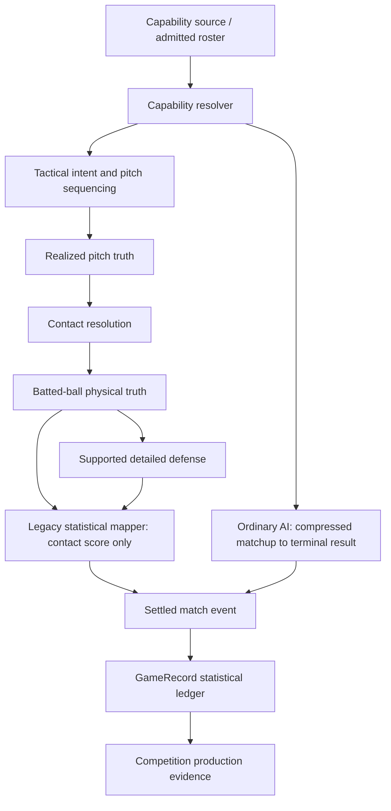

# Match Simulation Outcome Mapping Audit — Sprint 1

Physical Truth → Statistical Outcome Trace。驗收狀態：**PASS**。

本輪只稽核 architecture / dataflow；未修 production、未調參、未擴充 outcome、未改 Selection 或 Player P exposure。PASS 的含義是根因與最小施工邊界已被證明，不表示 simulation 已修好。

## 1. Baseline 與檔案

施工前：`main = origin/main = 35ba350`，ahead / behind `0 / 0`，working tree clean。最近兩筆為 `35ba350 test: establish ability performance correlation audit` 與 `46f8d2d feat: establish canonical full game records and player lines`。

本輪四個新增檔案：

- `tests/match-simulation-outcome-mapping-audit.cjs`：deterministic probes、source references、11 層 map、三條 P0 路徑、matrix 與 structured summary。
- `tests/match-simulation-outcome-mapping-test.js`：15 組 focused tests。
- `docs/match-simulation-outcome-mapping-audit-results.json`：摘要與小型診斷樣本，未輸出大量 raw PA dump。
- 本報告。

既有 Ability–Performance Audit runner、測試與結果全部保留。source-reading 在記憶體將 CRLF / CR 正規化為 LF；未改來源檔。JSON 中的 function reference 含實際行號與 normalized-source SHA-256。

## 2. 結論與優先級

|P0 audit target|Root cause|Severity|第一個斷點|排除項目|
|---|---|---|---|---|
|Power → HR / XBH / TB|MAPPING_GAP；DUAL_TRUTH_CONFLICT|P1|`OffensivePlateApproach.resolveLegacyBallInPlayOutcome`|Power 有進物理層；HR/XBH outcome 存在；ledger/evidence 可保留|
|Control → ordinary AI BB|MISSING_INPUT_PATH|P1|`resolveSimulatedHighSchoolPlateAppearance` 的壓縮輸入邊界|walk producer 存在；沒有可供調整的 Control 係數；不是 aggregation gap|
|Pitch Quality / Stuff → ordinary AI SO|OUTCOME_SPACE_GAP；OUTCOME_SPACE_DIVERGENCE|P1|同函式 terminal result 集合|generic pitching 仍有作用；GameRecord 與 Evidence 可保留 SO|

上述 P0 是本輪調查優先路徑；severity 依證據定為 P1：重要能力無法形成所需統計。未發現 ledger 資料毀損，因此不因名稱含「truth」便直接判為 P0。

## 3. Canonical layer map 與 authority



G→H 表示部分未接到球的 compatibility continuation；成功接殺／ground-ball settlement 也能直接形成相容 PA 結果。圖不表示所有路徑都經過所有層。

|層|module / function|Input → output|Authority / 損失|
|---|---|---|---|
|1 Capability source|`team-roster-foundation.js:createGeneratedPlayer`；玩家既有 genesis/settlement admission|team prior / position → roster scalars；玩家 skills → admitted view|CANONICAL_TRUTH：已 admitted 能力來源。共同 prior 不等於欄位彼此因果相連|
|2 Capability resolver|`script.js:getOffensiveSimulationCapability / getHighSchoolOffensivePlateApproachAbilities`|玩家 batting/fitness/instinct → rounded power；其他能力 view|DERIVED_TRUTH；rounding 與 composite 壓縮|
|3 Tactical / decision|`pitch-sequencing.js:createPitchDecision`|runtime、count、frozen distribution → intended / actual class|DERIVED_TRUTH；debugTrace 為 PROJECTION|
|4 Pitch physical|`offensive-plate-approach.js:generatePitchOpportunity / completePitchTruth`|actual class → strike / zone / quality / attackability / physical profile|CANONICAL_TRUTH（該 pitch 的 authoritative execution）；部分 profile 由 identity 生成，不是完整 Stuff physics|
|5 Contact|`getContactProbability / getSwingExecutionProfile`；`batted-ball-physical.js:resolveContactQuality`|execution rolls → contact；batting/attackability 等 → contact score|DERIVED_TRUTH；contact/no-contact 與 fair-contact quality 是不同階段|
|6 Batted ball|`batted-ball-physical.js:resolveBattedBallPhysicalTruth`|actual pitch / recognition / batting / power / rolls → ball truth|CANONICAL_TRUTH；pace/depth/type category 化|
|7 Defense|`defensive-opportunity-foundation.js:resolveDefensiveOpportunity` → reach/secure/throw/runner settlement|physical + active roster → responsibility / acquisition / contest|DERIVED_TRUTH；目前為有範圍的正式接口，非完整 park/scoring mapper|
|8 Statistical mapping|`offensive-plate-approach.js:resolveLegacyBallInPlayOutcome`；ordinary AI resolver|contact-score proxy 或 compressed matchup → PA token|LEGACY_ADAPTER；丟失物理形狀、守備／球場關係|
|9 Match event|`script.js:recordHighSchoolMatchSimulationEvent`；`recordHighSchoolMeaningfulPlateAppearance`|settled result / runner facts → event + ledger ingestion|CANONICAL_TRUTH（事件）；presentationSnapshot 是 PROJECTION|
|10 Match Game Record|`match-game-record.js:recordPlateAppearance`|event token + active P → batting/pitching counters|PROJECTION，亦是正式統計的 canonical ledger；無權重建上游物理結果|
|11 Competition Evidence|`high-school-competition-evidence.js:integrateFullGameProductionEvidence`|final ledger + appeared participation → stats clone / value|PROJECTION；raw stats 保留，value 是 evaluation projection|

UI_ONLY：`BattedBallPhysical.formatBattedBallPhysicalTruth` 與 offensive player-facing text；不得反推它們為 scoring authority。COMPATIBILITY_FALLBACK：無 runtime 的 pitch generator、缺 contact score 的 legacy quality、缺 roster control 的 runtime 預設值。不要把 event、derived score、presentation 與 fallback 統稱為 canonical。

## 4. Power：完整 trace 與 information-loss proof

玩家來源：`getOffensiveSimulationCapability` 以 `round((baseballSkills.batting + fitness + instinct)/3)` 產生 power；roster entity 則直接讀 `subject.power`。`getHighSchoolOffensivePlateApproachAbilities` 將 power 與 batting 分別傳入 interactive resolver。本輪在這個 derived ability seam 隔離 Power 8/10/12/14/16，未宣稱它是獨立可寫入的 player domain scalar。

正式路徑：`resolveHighSchoolOffensivePlateAppearance` → `simulatePlateAppearance` → `resolveNextPitch` → `resolveFairContactBallInPlay` → `resolveBattedBallPhysicalTruth` → `resolveLegacyBallInPlayOutcome` → `resolveHighSchoolOffensiveDecision` → meaningful `plateAppearance` → GameRecord → Evidence。後者記錄 `physicalTruthToLegacyDownstreamOutcome`，不是另一個已完成的 physical scoring mapper。

實際物理欄位：`version / identity / contactQuality / ballType / pace / direction / depth / executionEvidence`。executionEvidence 保存 actualPitch、recognition、swing、continuousContactScore、paceScore、depthScore、rolls、depthRollConsumed。沒有 launch angle、落點座標、carry distance 或 fence-crossing truth；不可假設這些欄位已存在。

`continuousContactScore` 的輸入完整為：batting/20、actualPitch.attackability、recognition.correct、swingIntent、identity-based contactQuality roll；它不讀 Power。action/contact 在 executionEvidence 留存，但不進該 score 公式。Power 正式影響 ballType、pace 與 airborne depth。

mapper 先讀 `physicalTruth.executionEvidence.continuousContactScore`。僅此值非 finite 時，才 fallback 至 attackability、batting、ballSense、swingIntent、recognition.correct。再用 swingIntent modifier 與 outcomeRoll（或 PA identity / pitchNumber 的 deterministic roll）選 token；runner/outs context 只影響 productiveOut fallback。它不讀 pace、depth、direction、ballType、paceScore/depthScore、defender 或 park。

Deterministic proof 固定 PA identity、pitch、batting=12、recognition、swingIntent、物理 rolls、outcomeRoll=.5、空壘／0 out。此 standalone seam 沒有 defense input，所有 tiers 同樣缺少該輸入，不能把它稱為已包含守備的結果：

|Power|Pace|Depth|Continuous contact score|Terminal result|
|---|---|---|---|---|
|8|firm|medium|.759|single|
|10|firm|medium|.759|single|
|12|firm|deep|.759|single|
|14|hard|deep|.759|single|
|16|hard|deep|.759|single|

五級整份 mapper output 相同。反向控制保留**完全相同的 physical object**，僅將其正式 input outcomeRoll 從 0 改為 1，結果 out→homeRun；另以 counterfactual score probe 確認 mapper 對 continuousContactScore 有反應。這些是既有公開 seam 的診斷輸入，不是偽造正式比赛事件或提議改係數。

DUAL_TRUTH_CONFLICT 指同一擊球的物理與統計結果缺少因果一致性整合。**hard/deep 被接殺本身完全合法**，也不能以 deep=HR；本輪證據是 mapper 忽略與守備相關的物理差异，並獨立採樣 statistical result。不是根據單一球的文字表現判定不可能事件。

GameRecord probe 輸入 single/double/triple/homeRun/walk/strikeout，得到 PA=6、AB=5、H=4、2B=1、3B=1、HR=1、BB=1、SO=1；audit TB=10。不是 AGGREGATION_GAP，也不是 HR OUTCOME_SPACE_GAP。

## 5. Defense interface 與未來物理權威契約

既有 `BattedBallGroundDefense.resolveGroundBallDefensiveAccess` 消費 ground-ball truth；`BattedBallLineDriveDefense.resolveCatchAccess` 有 shallow line-drive scope；`BattedBallFlyBallDefense.resolveFlyBallCatchAccess` 有 medium/deep fly-ball scope。正式 responsibility → reach/secure → throw → runner/third-out settlement 已存在。depth/pace 可影響 catch access/window，但不是 fence 判定。

`script.js` 的 ordinary defensive PA 提供 `physicalOutcomeResolver` hook，支持 groundBallDefensePending / lineDriveCatchPending / flyBallCatchPending。Line-drive/fly-ball 接殺成功投影 out；未接到球時仍有 `catchFailureToTransitionalLegacyContinuation`，officialScoring 標 deferred。Ground-ball 有 `derivePACompatibilityResult`。這些 pending tokens 不是可直接當正式統計的 terminal PA outcomes。

缺的是完整「Physical → Defense / Park / Context → Official PA Outcome」邊界；不是只把 Power 接到 HR probability。未来契約應保持 physical object immutable，由單一 mapper 消費已結算守備、runner facts 與可用 context，回傳有來源的 official result。沒有 fence truth 時應明確界定支持範圍或 fallback，不可從 deep label 發明越牆事實。本輪不新增球場物理、不改 3B 或 Defensive Foundation 語意。

## 6. Control：interactive vs ordinary AI

Interactive source：`ensureHighSchoolPitcherRuntimeState` 讀 active away pitcher 的 `pitchingProfile.control`，乘 2 並限制 1–20；缺值 fallback 8。runtime → tactical/strategic intended class → `PitchSequencing.resolvePitchControl`（control、precisionIntent、rhythm、tempo、identity/roll）→ actual class → `PITCH_CLASS_PROFILES` 的 strike/attackability → take ball/strike → 四壞 walk。玩家 P 不因此自動獲得投球 exposure。

本輪找到固定 identity / intended class 下，Control tiers 會改變 actual class，且能跨越 strike/ball。另用正式 count resolver 證明 clearBall + take 四次產生 walk、competitiveStrike + take 三次產生 strikeout；不把單一 realization 差異宣稱為 BB calibration gradient。

Ordinary AI 的所有直接決策輸入：

```text
quality = contact*.025 + power*.012 + discipline*.008
pitcherPressure = (2*(pitcher.pitching || 5) + pitcherCapability.decision)*.004
runnerPressure = any runner ? .01 : 0
twoOutPenalty = outs==2 ? .015 : 0
trailingUrgency = offense trailing ? .005 : 0
adjusted = clamp(sample + quality + runnerPressure + trailingUrgency
                 - pitcherPressure - twoOutPenalty - .18, 0, .999999)
walk iff .58 <= adjusted < .69
```

這些數字是**現行 production 公式的抄錄**，不是 calibration 建議。輸入沒有 Control、pitch execution、catcher calling；team strength 不直接讀取，只有 roster generation prior 的間接來源。NPC decision=`round((defense+contact)/2)`；非 roster player decision=`round((baseballIQ+observe+discipline)/3)`，同樣不讀 Control。非 roster P 的 fielding view 雖會讀 control，但 AI pressure 用的是 decision，不能因 fielding view 有 control 就宣稱接到 BB。

walk 是 shifted interval 的機率質量，不可籠統稱「固定 11%」。對 uniform draw 是 `[.58-offset,.69-offset)` 與 `[0,1)` 的交集長度；正式 RNG 為有限 997-state 支持，實際 seed 集合另有離散差異。

Controlled proof：在真實 active NPC roster 的 profile.control 改 4/5/6/7/8（interactive 對應 8/10/12/14/16），其餘 roster 欄位不变。每 tier 32 個固定 seeds，共 160 次：production prefix trace 與 untouched full resolver 一致；跨 tier 每個直接 score、threshold、result、native RNG cursor 相同。五級各為 out16、productiveOut3、walk3、single5、double2、triple1、HR2。這些不是長期 BB 率估計。

`pitching / control / stuff` 在 roster generation 共享 team prior，但分別抽樣；`pitchingProfile.effectiveness` 是 pitching 副本，不含 Control 的 composite。生成時的相關性不可當成 Control causal path。結論 **MISSING_INPUT_PATH**，不叫 WEAK_COEFFICIENT。

## 7. SO outcome space 與 Pitch Quality / Stuff

直接由 current production result statement 取出 ordinary AI 所有 terminal tokens：`out, productiveOut, walk, single, double, triple, homeRun`。沒有 strikeout；不是靠大量樣本未出現 SO 推論。

Interactive `resolveNextPitch` 正式處理 ball、calledStrike、swingingStrike、foul、ballInPlay；四壞 terminal walk，第三好球 terminal strikeout，fair contact 交給 BIP mapper。Physical hook 的 pending 状態另由 defense 解決，不納入正式 terminal matrix。

|Outcome / truth|Interactive|Ordinary AI|Shared downstream / parity|
|---|---|---|---|
|BB / walk|有|有|相同 PA token / ledger / evidence；producer 語意不同|
|SO / strikeout|有|無|ledger/evidence 支持，AI upstream 缺 producer|
|1B / single|有|有|terminal token compatible|
|2B / double|有|有|terminal token compatible|
|3B / triple|有|有|terminal token compatible|
|HR / homeRun|有|有|terminal token compatible；不表示物理映射正確|
|generic out|有|有|共享 runner/event/ledger downstream|
|productiveOut|有|有|共享相容 token；compressed AI 並非 physical defense 證明|
|batted-ball truth|有|無|AI generic resolver 跳過 physical/defense|
|pitch physical truth|有|無|不能為 compressed AI 補造 pitch-level facts|

`pitcher.pitching` 的 generic signal 仍存在：固定 sample=.9，pitching4→8 令 pressure .064→.096，adjusted .999999→.972，結果 homeRun→triple。既有 Sprint 1.1 的 NPC H/BF 與 ER27 訊號不被推翻，這輪不重跑大樣本。

精確區分：aggregate **pitching** 已接 generic matchup/run prevention；獨立 `pitchingProfile.stuff` 未被 ordinary AI 讀取，而且 AI outcome space 根本沒有 SO。Interactive pitchQuality 為 control realization category 派生，不能把它自動視為 roster Stuff 的直接效果。SO 主因仍為 **OUTCOME_SPACE_GAP / OUTCOME_SPACE_DIVERGENCE**。

ledger probe 的 batter SO=1、active pitcher SO=1，BF=6；同一 BB event 也各計 BB=1。CompetitionEvidence 對 offense / pitching 原樣 clone 全部 stats，HR/BB/SO 都保留。不是 evaluation、Selection 或 aggregation 丟失。

## 8. Compression / Shared Outcome future contract

目前 compression boundary 位於 `resolveSimulatedHighSchoolPlateAppearance`：在 capability views 之後，直接以單一 draw 與 adjusted score選 terminal result。沒有先生成後丟棄 pitch/batted-ball object；那些高解析度 truth 在該路徑從未被構造。

未來 compressed AI 可以維持較低計算成本，但必須產生相容的官方棒球結果。最低概念契約：PA-level `walk / strikeout / ballInPlay`；BIP-level `out / single / double / triple / homeRun` 與現有具適用條件的 productiveOut / sacrifice / error。GameRecord 已認識 hitByPitch/HBP 等 ingestion aliases，但不代表普通 AI 或 interactive generator 已會產生；要明列支持狀態，不在此改 enum。

每個正式 PA 結果應有 identity、offense/batter/active-pitcher attribution、terminal result、before/after outs、runner/scoring facts 與 authority/provenance。不能丟 SO/BB 與 AB/BF 的語意；不能將 defensePending 或 UI 文句直接記成 official result。Pitch/ball 的連續細節可有明確壓縮契約，但不可宣稱未觀測的 pitch facts，或有一份 physical truth 卻另採不相干 scoring truth。

建議拆兩個 construction boundaries：

1. **Batted-Ball Outcome Mapping**：物理 → 既有 defense / context → official BIP outcome；消除獨立 proxy 結果與未解 compatibility continuation。
2. **AI Plate Appearance Outcome Expansion**：正式界定 compressed execution 的 Control / generic pitching / Stuff 輸入與 BB/SO/BIP 語意。Control BB 與 AI SO 可在這個狹義邊界共同設計，先處理 authority / RNG ownership，再談係數。

二者修改不同 authority，優先拆開。不建議只為減少 Sprint 數量，把物理守備 mapper 與 compressed AI resolver 合併。所有最終平衡係數留待架構修復後決定；本輪均未施工。

## 9. Secondary classification only

|項目|分類|本輪界線|
|---|---|---|
|Steal|OUTCOME_SPACE_GAP|`recordRunnerEvent` 支持 SB/CS ingestion；無正式 steal execution producer。只確認、不創造 attempts|
|Arm|QUANTIZATION_PLATEAU / P2|continuous arm → strength quality → throwQuality → timing delay。非完全未接線，不調 thresholds|
|Player P|BLOCKED_BY_EXPOSURE|保留 pitcherExposureDeferred / noAppearance；不改 playing-time-game-exposure，不強制 P、不塞 BF|
|Catcher|NOT_OBSERVABLE / DECISION_ONLY_OBSERVABLE|既有戰術／接球流程不等於完整 catcher statistical producer；不新增統計|

無需為上述分類建造缺失 producer，故不觸發本輪 Stop H/G。本輪 Stop 條件與前輪字母不同，不沿用 Sprint 1.1 的 Stop C 標號。

## 10. Tests、驗證與限制

Focused tests：15/15 PASS，對應 user spec 的 15 項：Power physical、mapping 前差異、consumer capture、HR/XBH ledger、interactive Control、deterministic AI trace、Control isolation、AI outcome enumeration、interactive SO、AI SO absence、SO ledger、BB/SO/HR evidence、parity matrix、RNG neutrality、fixture/input immutability。

儀器使用既有 pure modules 與 isolated browser VM。Source prefix 是 production 函式原文，在另一個名稱下讀出中間值；每次與**未替換的完整 production resolver**在相同 fresh copy 上比較。沒有更換 RNG 或插入 production hook。Resolver 正常變更 disposable match copy 的 events/cursor；不把「本機測試副本完全不變」作為錯誤要求。玩家能力、基礎 fixture、pure input、被 Evidence 讀取的 GameRecord 都有不變性檢查。

Ledger/evidence probe 是依現有測試慣例建立的 synthetic ingestion contract fixture，非真實完整比賽，不用它宣稱得分／局數完整性、player P exposure 或 performance rate。完整比賽另外由 1,400 場 audit 驗證。

最終驗證：PASS。指定依賴包含 Ability–Performance、Offensive Plate Approach、Batted Ball Physical、Pitch Sequencing、Pitcher-Catcher、GameRecord、Competition Evidence、County/National Selection、Defensive runner/throw settlement；已由完整回歸覆蓋；詳細檔名保存在 JSON validation.selectedDependencies。

重現：

```text
node tests/match-simulation-outcome-mapping-audit.cjs
node tests/match-simulation-outcome-mapping-test.js
```

第一個命令重建測量與 structured architecture summary；final validation 是獨立執行後的證據，重跑測量不會假裝重新通過 full suite。

最終保持工作樹供人工驗收，未 commit、未 push，未開始任一 construction / calibration / exposure / refinement Sprint。

## 11. Final validation / Closeout

|檢查|實際結果|
|---|---|
|Focused audit|15/15 PASS|
|Full JS/CJS syntax|248/248 PASS|
|Full regression|164/164 FULL GREEN（原 163 + 本輪 1 個 focused test module）|
|1,400-game audit|1,000 bench + 400 starter 全部完成|
|Integrity|orphan 0 / no-progress 0 / match-state 0 / game-record 0|
|Determinism / instrumentation neutrality|皆 true|
|Production / tracked diff|0 / 0|
|git diff --check / 新檔空白檢查|PASS|
|git status|僅本輪四個 untracked audit 檔案|
|Stop Conditions A–K|均未觸發；不需要建造缺失 producer 來完成 trace|
|Commit / push / next Sprint|皆未執行|

結論：**Audit PASS**。Power=MAPPING_GAP；Control=MISSING_INPUT_PATH；ordinary AI SO=OUTCOME_SPACE_GAP。三者均排除 GameRecord / CompetitionEvidence aggregation 瓶頸。建議下一步分 A/B 兩個 authority boundary 規劃，保持 working tree 等待人工驗收。
